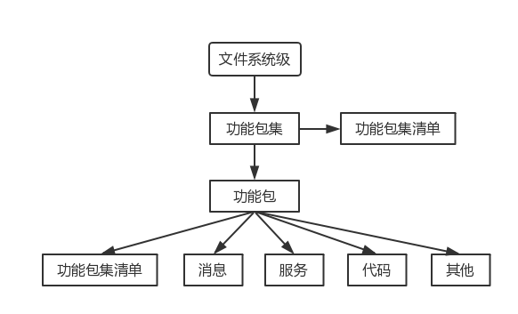

# Note of Learning ROS

> 2018-04-09

## References

1. [古月居](http://www.guyuehome.com/column/ros-explore/page/3)
2. [ROS](http://wiki.ros.org/)
3. [Gazebo](http://gazebosim.org/tutorials)
4. ROS机器人程序设计(Learning ROS for Robotics Programming)

## 1. Install

* OS: Ubuntu14.04
* ROS indigo
* 安装过程完全参考[ROS官方教程](http://wiki.ros.org/indigo/Installation/Ubuntu)

## 2. ROS系统架构

### 2.1 Levels of ROS

* Filesystem Level
* Computation Graph Level
* Community Level

### 2.2 Filesystem Level of ROS

### 2.3 Computation Graph Level of ROS

### 2.4 Community Level of ROS

