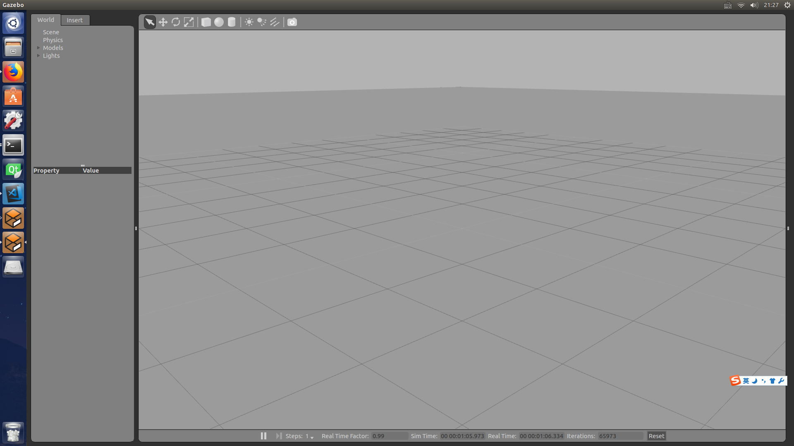

# Note of Learning Gazebo

> 2018-04-08

## 参考链接

1. [若风随云](http://waitrobot.com/category/gazebo/)
2. [Gazebo](http://gazebosim.org/tutorials)

注意这里的很多东西翻译自Gazebo官方网站，所以可以直接通过参考链接2学习Gazebo，忽略本文。

## 1. 安装Gazebo

由于在安装ROS indigo版本的时候，就已经将Gazebo安装好，所以可以直接进入下一步。

## 2. Gazebo简介

Gazebo是一款3D动态仿真器，能够精确高效在复杂的室内外环境对机器人群进行仿真。<br>
当对游戏引擎进行仿真时，Gazebo可以提供更高的物理真实度、一系列传感器以及用户程序接口。

* 一般对Gazebo的使用包括：
    * Testing robotics algorithms
    * Designing robots
    * Performing regression testing with realistic scenarios
* Gazebo的一些关键的特性：
    * Multiple physics engines
    * A rich library of robot models and environments
    * A wide variety of sensors
    * Convenient programmatic and graphical interfaces

### 2.1. Gazebo GUI界面

请看图：<br>


可以用鼠标对界面进行以下操作<br>


左侧的面板包括两个部分：
* Insert(可以通过这个Tab为模型的编辑添加新的部件(links and models))，并有下面三个部分：
    * Simple Shapes
    * Custom Shapes
    * Model Database
    * 对于比较旧的版本，没有上面的三个部分
* World(对于新版本来说是Model)
    * Scene
    * Physics
    * Models
    * Lights

官方制作小车的例子：[Vehicle construction](http://gazebosim.org/tutorials?cat=guided_b&tut=guided_b3)

### 2.2. Gazebo Log Files(记录文件)

Logging from the GUI:
* Default Path: ~/.gazebo/log/)

Logging from the command line:
* As an example to recode the "random_velocity.world" as follows:
```sh
gazebo -r --record_path ~/logs/random_velocity worlds/random_velocity.world
```

需要提醒的是：<br>
Once you have a log file, you can replay it visually or introspect it in several ways.

Visualize in GUI:
```sh
gazebo -u -p ~/logs/double_pendulum/2016-01-25T15\:09\:49.677400/gzserver/state.log
```
> Tip: The -u option starts the log paused.

Command line tools:<br>
We'll use -s to step through a recorded file, like this:
```sh
gz log -s -f ~/logs/double_pendulum/2016-01-25T15\:09\:49.677400/gzserver/state.log
```
Then you will see a SDF representation of the world.

## 3. Gazebo的组成

* Treats URDF and SDF as equally as possible
* Reduces code duplication(重复) with Gazebo
* Improves out of the box support for controllers using ros_control
* Integrates real time controller efficiency improvements from the DARPA Robotics Challenge
* Cleans up old code from previous versions of ROS and Gazebo


### 3.1. World文件

### 3.2. Model文件